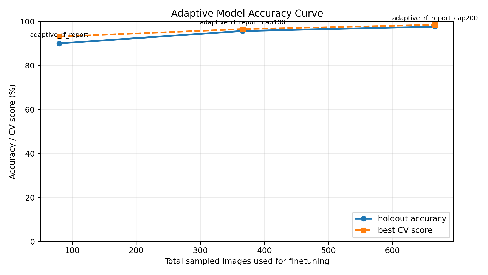
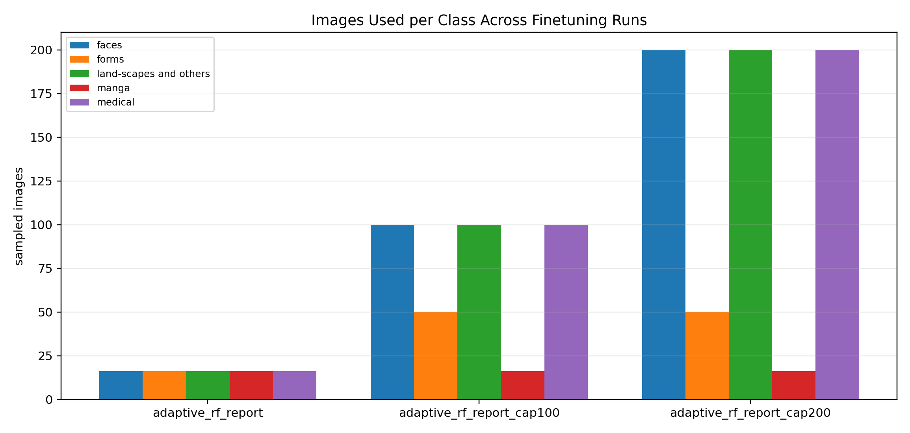
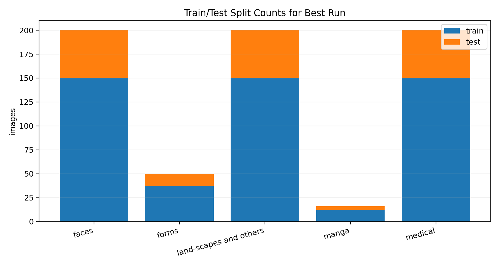
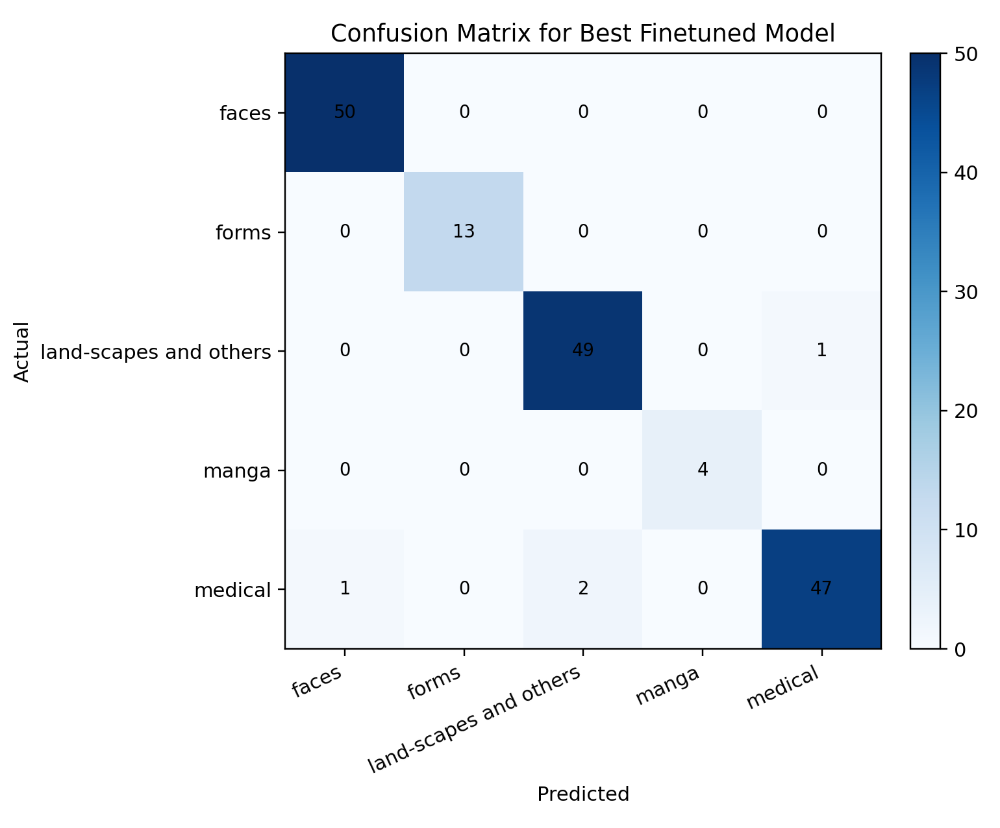
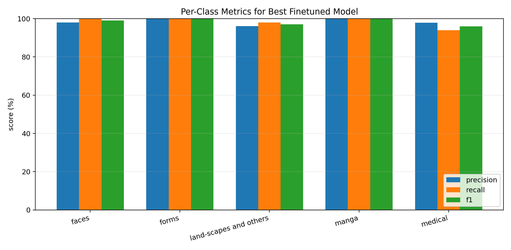
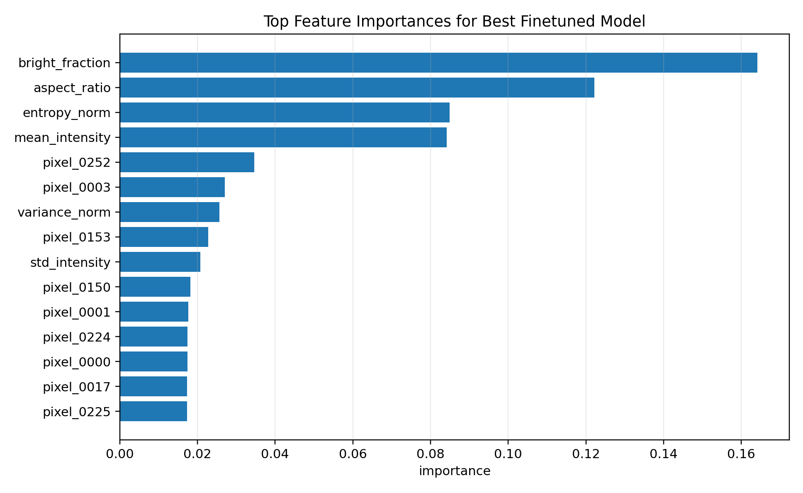

# Adaptive Model Finetuning Report

Date: 2026-04-02

This report summarizes the Random Forest finetuning runs used to upgrade the adaptive sensitivity layer.

## 1. Experiments Compared

| Run | Total sampled images | Holdout accuracy | Best CV score |
| --- | ---: | ---: | ---: |
| `adaptive_rf_report` | 80 | 90.00% | 93.11% |
| `adaptive_rf_report_cap100` | 366 | 95.65% | 96.50% |
| `adaptive_rf_report_cap200` | 666 | 97.60% | 98.45% |

## 2. Best Model

- Best run: `adaptive_rf_report_cap200`
- Holdout accuracy: `97.60%`
- Best cross-validation score: `98.45%`
- Output model: `adaptive_rf_report\adaptive_random_forest_cap200.pkl`

Class usage in the best run:

| Class | Images used |
| --- | ---: |
| `faces` | 200 |
| `forms` | 50 |
| `land-scapes and others` | 200 |
| `manga` | 16 |
| `medical` | 200 |

Per-class metrics in the best run:

| Class | Precision | Recall | F1 |
| --- | ---: | ---: | ---: |
| `faces` | 98.04% | 100.00% | 99.01% |
| `forms` | 100.00% | 100.00% | 100.00% |
| `land-scapes and others` | 96.08% | 98.00% | 97.03% |
| `manga` | 100.00% | 100.00% | 100.00% |
| `medical` | 97.92% | 94.00% | 95.92% |

## 3. Graphs

## 4. Interpretation

- Increasing the usable dataset size improved both holdout accuracy and cross-validation score.
- Converting medical DICOM slices to PNG made the medical class usable in the same training pipeline as the raster classes.
- The strongest run used larger capped samples from the large folders while keeping smaller classes such as `manga` and `forms` at their actual available counts.
- This finetuned model is the one integrated into the adaptive pipeline for the rerun evaluation.
